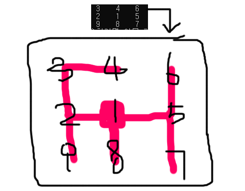
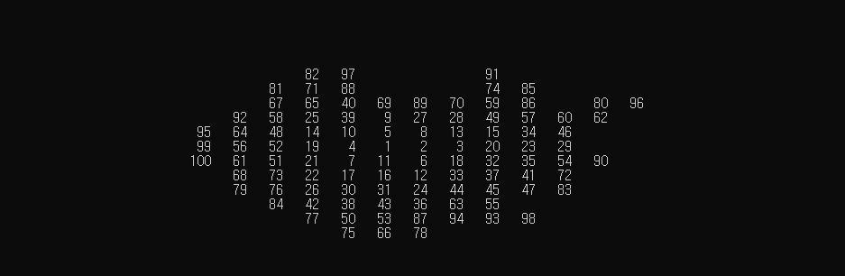
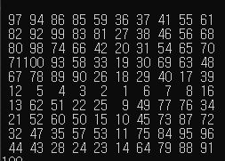
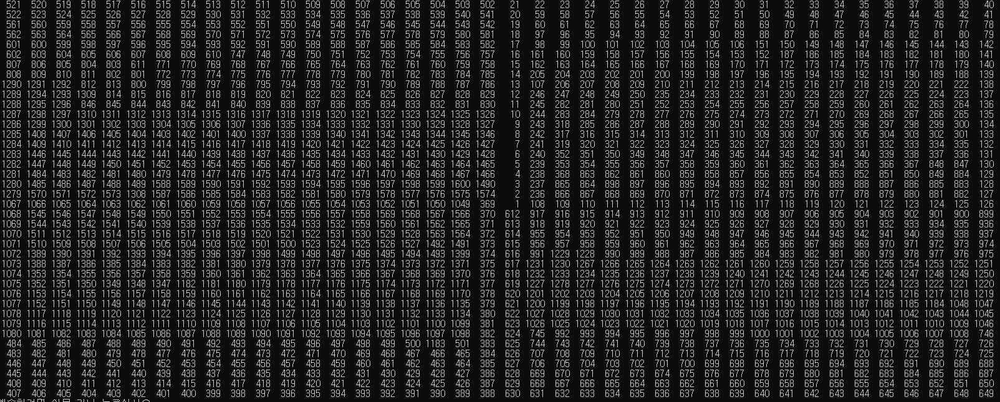

# Random Map Maker
  
위와같은 구조로 랜덤 트리를 생성을 위해 작성한 코드.   
트리지만 펼치면 배열같은 구조이기 때문에, 노드(Map)가 갖는 num의 번호를 기억하는 배열을 하나 만들어 배열출력으로 위치를 볼 수 있음.   
트리는 노사이클에 최대 3~4개(동서남북)의 가지수를 가질 수 있음.   
N번만큼 유효한 위치 값 얻을 때까지 재귀 돌림. 예외사전(ExceptionDic)을 통해 막힌 맵쪽을 사전 차단하여 시간 단축.   
   
   
## 성능     
   
몰릴수도 있고, 안 몰릴수도있고..   
    
   
꽉채우기      
    
   
40x40 에 1600숫자 넣은거~   
숫자가 몰려있는데, new Random()을 계속 선언하면서 일련의 난수가 발생된 것이다.  전역변수를 사용해 해결했다.   
   
   
## 후기   
자료구조랑 알고리즘을 더 잘했다면 더 효율적인 코드를 작성할 수 있지않았을까.   
트리 배열 섞어사용한게 비효율적인 것 같은데, 이렇게 밖에 구현을 못 하겠다.   
얕은복사 깊은복사가 헷갈렸는데, 오류를 통해서 덜 헷갈리게 됨.   
   
   
해결했다 이제 유니티에서 알아서 응용만하면 짝짝짝  
   
### 2020/06/29 